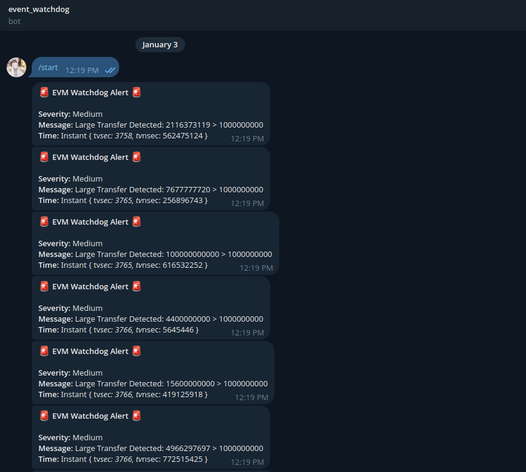
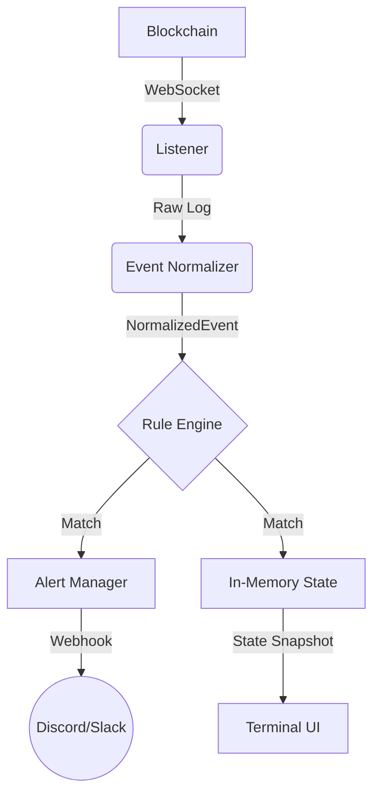

# EVM Event Watchdog 🛡️

### **Detect rug pulls and exploits before they drain millions.**


[](https://nihal-pandey-2302.github.io/evm_event_watchdog/)

```text
A production-grade security monitor that watches Ethereum, Polygon,
and Arbitrum for suspicious activity in real-time. Built with Rust
for maximum performance.

✅ Live Telegram/Discord alerts
✅ Sub-second detection latency
✅ Professional TUI with filtering
✅ Currently monitoring mainnet (see live alerts)

Perfect for DeFi protocols, wallet providers, and security teams.
```

## 📱 Live Alerts & Dashboard

|           Real-Time TUI           |           Live Telegram Alerts           |
| :-------------------------------: | :--------------------------------------: |
|               |  |
| _Zero-latency terminal dashboard_ |  _Instant notifications on your phone_   |

---

## 🔐 Threat Model

The watchdog is designed to surface early indicators of:

- Privileged role abuse (`OwnershipTransferred`)
- Unlimited token approvals (`uint256.max`)
- Sudden high-value fund movements

It is not an exploit detector, but a real-time signal generator intended to complement audits, monitoring bots, and human oversight.

---

## ✨ Features

- **Real-Time Detection Engine**:

  - **Threshold Rules**: "Transfer > 10,000 USDT"
  - **State Changes**: "Ownership Transferred"
  - **Security Audits**: "Infinite Approval (> 50% uint256)"

- **Enterprise-Grade Expansion (Hackathon Update)**:
  - **Multi-Chain Support**: Simultaneous monitoring of Ethereum, Polygon, Arbitrum.
  - **Rich Alerts**: Discord Webhooks with color-coded severity & rich embeds.
  - **Simulation Mode**: `--simulate` flag for Chaos Engineering & Demos.
- **Production-Ready TUI**:

  - **Zero-Latency Dashboard**: Backed by thread-safe atomic state.
  - **Signal Hygiene**: Auto-deduplication of repetitive alerts (`x25`).
  - **Mess-Free**: Strict log separation (TUI on stdout, logs to file).

- **Robust Architecture**:
  - **Async/Await**: Built on `tokio` and `alloy`.
  - **Resilient**: Auto-reconnecting WebSocket listeners.
  - **Alert Dispatch**: Configurable webhooks (Slack/Discord) with rate limiting.

---

## 🚀 Quick Start

### 1. Prerequisites

- **Rust/Cargo**: [Install Here](https://rustup.rs/)
- **Ethereum Node**: WebSocket URL (Infura, Alchemy, or Local).
- **(Optional) Alerts**:
  - **Discord**: Webhook URL.
  - **Telegram**: Bot Token + Chat ID.

### 2. Configuration

Create a `.env` file in the root directory:

```bash
RPC_URL=wss://mainnet.infura.io/ws/v3/YOUR_API_KEY
DISCORD_WEBHOOK_URL=https://...
TELEGRAM_BOT_TOKEN=123:ABC...
TELEGRAM_CHAT_ID=12345
```

> **Security Note**: We recommend setting secrets in `.env`. The `config.toml` file is for public, structure-based configuration.

Verify `config.toml` (default provided):

```toml
[chains.ethereum]
rpc_url = "env:RPC_URL"

[alerts]
webhook_url = "env:DISCORD_WEBHOOK_URL" # Set via DISCORD_WEBHOOK_URL in .env
telegram_bot_token = "env:TELEGRAM_BOT_TOKEN" # Set via TELEGRAM_BOT_TOKEN
telegram_chat_id = "env:TELEGRAM_CHAT_ID" # Set via TELEGRAM_CHAT_ID

[[contracts]]
name = "USDT"
address = "0xdac17f958d2ee523a2206206994597c13d831ec7"

[rules.transfer_threshold]
min_value = "1000000000" # 1000 USDT (6 decimals)
severity = "Medium"
```

### 3. Run

Launch the watchdog:

```bash
cargo run --release
```

**Note**: Application logs are written to `logs/watchdog.log.DATE` to keep the TUI display clean.


_Mainnet event detection with structured logs (non-TUI mode)_

---

## 🖥️ Architecture



### Signal Hygiene

The system implements strict hygiene to prevent alert fatigue:

1.  **Deduplication**: Identical sequential events are collapsed into a single row with a counter.
2.  **Filtering**: Low-severity events are logged to file but excluded from the TUI feed.
3.  **Render Capping**: The TUI enforces hard rendering limits to maintain stable, low-latency updates under high event throughput.

## ⚠️ Failure Handling

- **WebSocket Disconnects**: Trigger automatic reconnection.
- **Backpressure**: Event processing is decoupled from ingestion to prevent stalls.
- **UI Isolation**: Rendering is entirely independent of ingestion.

## 🧠 Design Philosophy

The system prioritizes **signal quality over feature breadth**.
Decisions such as using a TUI, in-memory state, and aggressive deduplication were intentional to:

- Minimize latency
- Avoid alert fatigue
- Preserve operational simplicity

The watchdog is designed to run alongside nodes and infrastructure services, not as a user-facing dashboard.

## 🕹️ Controls (Interactive Mode)

- **Selection Menu**: Run `cargo run` (without arguments) to pick a specific chain or "Monitor All".
- **Runtime Filtering**: Press `Tab` inside the TUI to cycle views: `[Filter: ALL] -> [Filter: Ethereum] -> [Filter: Polygon]`.
- **Exit**: Press `q` to quit.

## 🔮 Future Work (Out of Scope)

- **Persistence**: Database integration.
- **Automated Response**: Pausing contracts via multisig.

These are intentionally excluded to keep the core watchdog fast, focused, and reliable.

---

## 🛠️ Development

### Project Structure

- `src/main.rs`: Application entry & orchestration.
- `src/tui.rs`: TUI rendering logic (Ratatui).
- `src/state.rs`: Shared atomic state containers.
- `src/rules/`: Detection logic implementation.
- `src/listener/`: Blockchain subscription management.

### Testing

Run the test suite:

```bash
cargo test
```

---

## License

MIT
