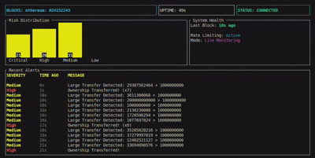
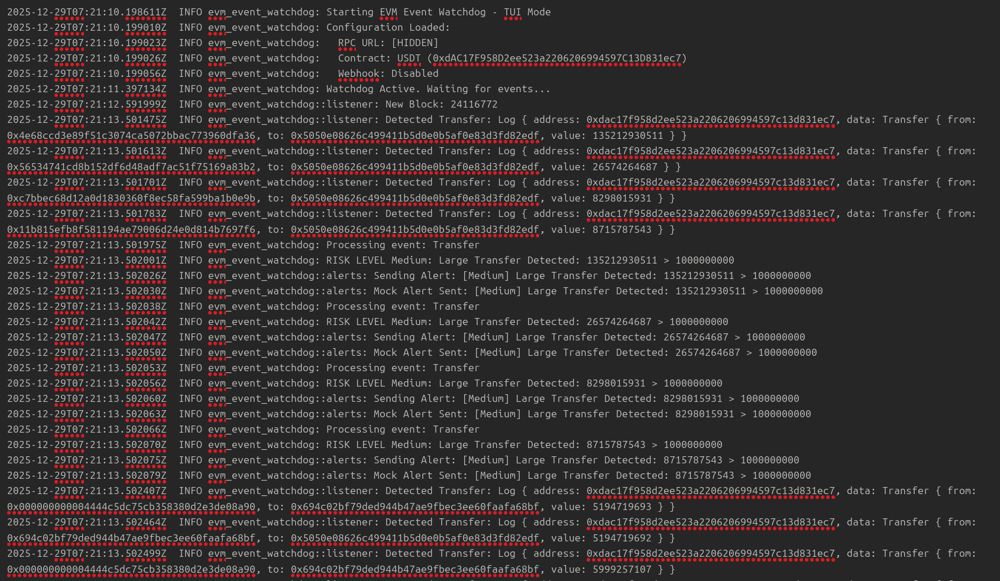
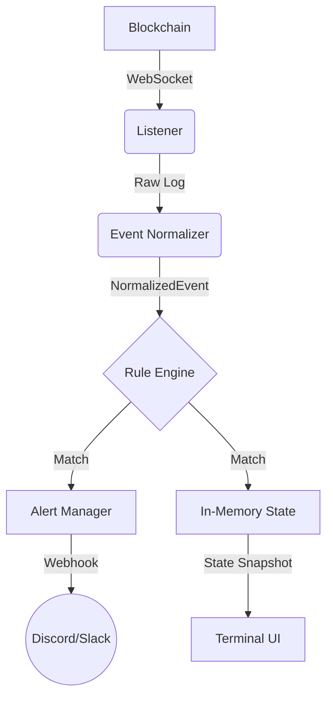

# EVM Event Watchdog 🛡️

**A high-performance, real-time security monitor for EVM blockchains.**

The **EVM Event Watchdog** detects critical on-chain anomalies—such as large transfers, ownership changes, and infinite approvals—and visualizes them in a professional-grade Terminal UI (TUI).




---

## 🎯 Why This Matters

On-chain security incidents often escalate within minutes. Large transfers, ownership changes, or infinite approvals can indicate:

- Compromised keys
- Rug pulls or admin abuse
- Exploit preparation or active draining

EVM Event Watchdog provides immediate, low-latency visibility into such events, enabling faster human or automated response before irreversible damage occurs.

---

## 🔐 Threat Model

The watchdog is designed to surface early indicators of:

- Privileged role abuse (`OwnershipTransferred`)
- Unlimited token approvals (`uint256.max`)
- Sudden high-value fund movements

It is not an exploit detector, but a real-time signal generator intended to complement audits, monitoring bots, and human oversight.

---

## ✨ Features

- **Real-Time Detection Engine**:
  - **Threshold Rules**: "Transfer > 10,000 USDT"
  - **State Changes**: "Ownership Transferred"
  - **Security Audits**: "Infinite Approval (> 50% uint256)"
- **Production-Ready TUI**:

  - **Zero-Latency Dashboard**: Backed by thread-safe atomic state.
  - **Signal Hygiene**: Auto-deduplication of repetitive alerts (`x25`).
  - **Mess-Free**: Strict log separation (TUI on stdout, logs to file).

- **Robust Architecture**:
  - **Async/Await**: Built on `tokio` and `alloy`.
  - **Resilient**: Auto-reconnecting WebSocket listeners.
  - **Alert Dispatch**: Configurable webhooks (Slack/Discord) with rate limiting.

---

## 🚀 Quick Start

### 1. Prerequisites

- **Rust/Cargo**: [Install Here](https://rustup.rs/)
- **Ethereum Node**: WebSocket URL (Infura, Alchemy, or Local).

### 2. Configuration

Create a `.env` file in the root directory:

```bash
RPC_URL=wss://mainnet.infura.io/ws/v3/YOUR_API_KEY
```

Verify `config.toml` (default provided):

```toml
[chains.ethereum]
rpc_url = "env:RPC_URL"

[[contracts]]
name = "USDT"
address = "0xdac17f958d2ee523a2206206994597c13d831ec7"

[rules.transfer_threshold]
min_value = "1000000000" # 1000 USDT (6 decimals)
severity = "Medium"
```

### 3. Run

Launch the watchdog:

```bash
cargo run --release
```

**Note**: Application logs are written to `logs/watchdog.log.DATE` to keep the TUI display clean.


_Mainnet event detection with structured logs (non-TUI mode)_

---

## 🖥️ Architecture



### Signal Hygiene

The system implements strict hygiene to prevent alert fatigue:

1.  **Deduplication**: Identical sequential events are collapsed into a single row with a counter.
2.  **Filtering**: Low-severity events are logged to file but excluded from the TUI feed.
3.  **Render Capping**: The TUI enforces hard rendering limits to maintain stable, low-latency updates under high event throughput.

## ⚠️ Failure Handling

- **WebSocket Disconnects**: Trigger automatic reconnection.
- **Backpressure**: Event processing is decoupled from ingestion to prevent stalls.
- **UI Isolation**: Rendering is entirely independent of ingestion.

## 🧠 Design Philosophy

The system prioritizes **signal quality over feature breadth**.
Decisions such as using a TUI, in-memory state, and aggressive deduplication were intentional to:

- Minimize latency
- Avoid alert fatigue
- Preserve operational simplicity

The watchdog is designed to run alongside nodes and infrastructure services, not as a user-facing dashboard.

## 🔮 Future Work (Out of Scope)

- **Multi-Chain Support**: Polygon, Arbitrum.
- **Persistence**: Database integration.
- **Automated Response**: Pausing contracts via multisig.

These are intentionally excluded to keep the core watchdog fast, focused, and reliable.

---

## 🛠️ Development

### Project Structure

- `src/main.rs`: Application entry & orchestration.
- `src/tui.rs`: TUI rendering logic (Ratatui).
- `src/state.rs`: Shared atomic state containers.
- `src/rules/`: Detection logic implementation.
- `src/listener/`: Blockchain subscription management.

### Testing

Run the test suite:

```bash
cargo test
```

---

## License

MIT
